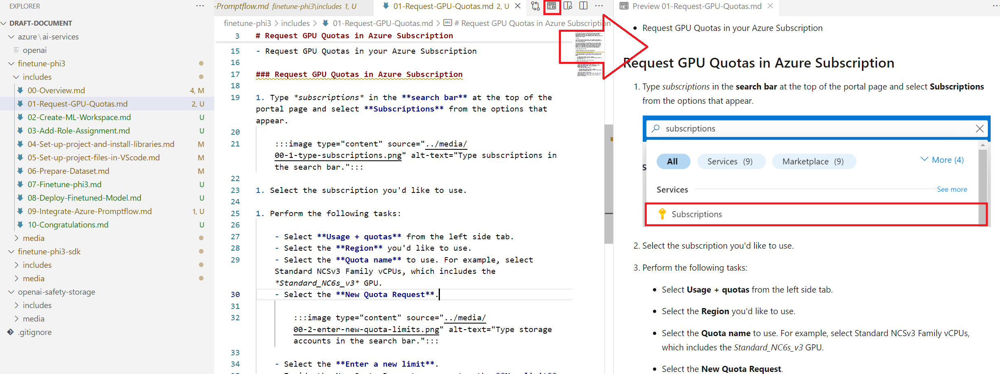
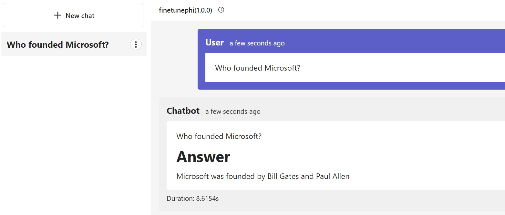
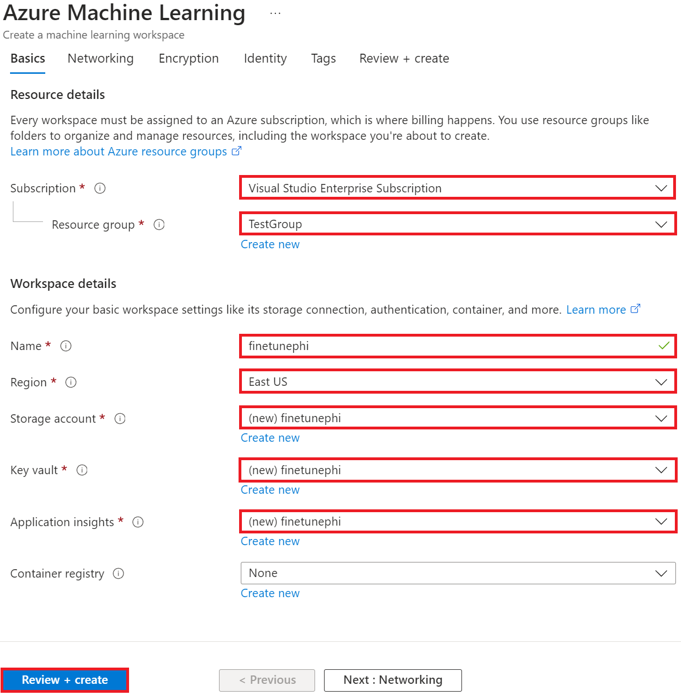

# VS Code 문서 작성 팁

### 미리보기 사용해서 작업하기

1. 아래 사진에 나와있는 신문 모양의 버튼을 선택해서 왼쪽에는 마크다운 창, 오른쪽에는 마크다운 예시 창을 띄워놓고 작업합니다.

    

### 자동 넘버링 활용

> [!TIP]
> 마크다운에서는 `1.` 을 계속 사용해도 순서를 자동으로 정해줍니다. 자동 넘버링 기능을 이용하면 튜토리얼에서 설명 순서를 중간에 바꿔야 하는 경우 기존 번호를 바꿀 필요 없이 손쉽게 바꿀 수 있습니다.
>

#### 자동 넘버링 활용 예시

1. Type *azure machine learning* in the **search bar** at the top of the portal page and select **Azure Machine Learning** from the options that appear.

    

1. Select **+ Create** from the navigation menu.

1. Select **New workspace** from the navigation menu.

#### 자동 넘버링 활용 x

1. Type *azure machine learning* in the **search bar** at the top of the portal page and select **Azure Machine Learning** from the options that appear.

    

2. Select **+ Create** from the navigation menu.

3. Select **New workspace** from the navigation menu.

### 들여쓰기 (사진, 코드)

> [!TIP]
> `1.` 이나 `-`와 같은 리스트를 설명하는 사진이나 코드를 첨부할 때는 `1.` 혹은 `-` 밑에 4칸 들여쓰기를 적용해서 사진을 첨부합니다.
>

#### 들여쓰기 적용 예시

1. 채팅 예시를 설명하는 내용입니다.

    

1. 다음 내용으로는 ~

#### 들여쓰기 적용 x

1. 채팅 예시를 설명하는 내용입니다.

1. 다음 내용으로는~

> [!NOTE]
> 사진 들여쓰기를 제대로 안했을 경우 자동으로 넘버링 해주는 기능이 작동 하지 않게 됩니다. 들여쓰기를 제대로 지키지 않으면 글의 가독성이 저하될 수 있습니다.

### 언제 `1.` 넘버링을 하고 언제 `-` 를 사용하는지 구분하기

> [!TIP]
> 하나의 사진 안에 해야할 게 여러개라면 `1. 사진설명` 안에 들여쓰기로 `-`를 입력합니다.
>

#### 적용 예시

1. Perform the following tasks:

    - Select your Azure **Subscription**.
    - Select the **Resource group** to use (create a new one if needed).
    - Enter **Workspace Name**. It must be a unique value.
    - Select the **Region** you'd like to use.
    - Select the **Storage account** to use (create a new one if needed).
    - Select the **Key vault** to use (create a new one if needed).
    - Select the **Application insights** to use (create a new one if needed).
    - Select the **Container registry** to **None**.

    

1. Select **Review + Create**.

1. Select **Create**.

#### 적용 x

1. Select your Azure **Subscription**.
1. Select the **Resource group** to use (create a new one if needed).
1. Enter **Workspace Name**. It must be a unique value.
1. Select the **Region** you'd like to use.
1. Select the **Storage account** to use (create a new one if needed).
1. Select the **Key vault** to use (create a new one if needed).
1. Select the **Application insights** to use (create a new one if needed).
1. Select the **Container registry** to **None**.

> [!NOTE]
> 이렇게 했을 경우 이 사진을 제대로 들여쓰기 하기가 어렵습니다.

1. Select **Review + Create**.

1. Select **Create**.
