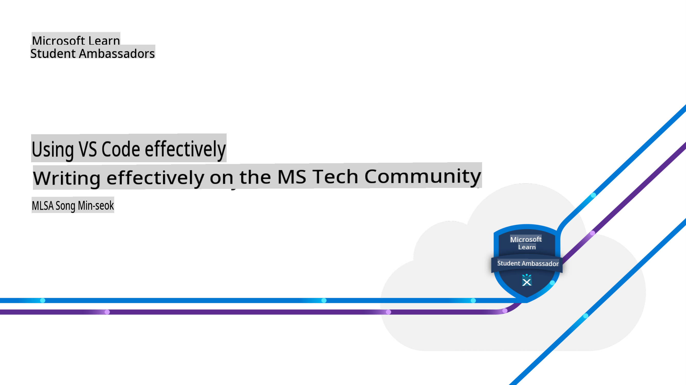

# How to Effectively Write on MS Tech Community Using VS Code

## 🌐 Multilingual Translation Support

> **Note:**
> This translation was automatically generated using the open-source [co-op-translator](https://github.com/Azure/co-op-translator) and may contain errors or inaccuracies. For critical information, it's recommended to refer to the original or consult a professional translator. To add or update translations, refer to the [co-op-translator](https://github.com/Azure/co-op-translator) repository, which allows easy contributions using simple commands.

| Language             | Code | Link to Translated README                               | Last Updated |
|----------------------|------|---------------------------------------------------------|--------------|
| English | en   | [English Translation](./README.md)      | 2024-10-24   |
| Punjabi (Gurmukhi)| pa   | [Punjabi Translation](../pa/README.md)      | 2024-10-24   |
| Hindi               | hi   | [Hindi  Translation](../hi/README.md)       | 2024-10-24   |

> [!NOTE]
> This is the reference and practice material provided during the "How to Effectively Write on MS Tech Community Using VS Code" presentation at the "Useful and Interesting Latest Technologies" seminar hosted by Korean MLSA (Microsoft Learn Student Ambassadors) on Monday, July 22, 2024, from 2:20 PM to 6:00 PM at the Smart Creative Talent Center on the 4th floor of the Yangcheon-gu Lifelong Learning Center.
>

## Table of Content

1. [Helpful Tips for Writing Technical Documents in VS Code](./ms-community-writer/includes/01-tips-for-vscode.md)(✅)
1. [Example of Writing Technical Documents in VS Code](./ms-community-writer/includes/02-example-for-vscode.md)(✅)

## Presentation Materials

1. [Presentation: How to Effectively Write on MS Tech Community Using VS Code - PDF](../../ms-community-writer/includes/presentation.pdf)(❌ PDF files are not currently supported for translation.)
1. [Presentation: How to Effectively Write on MS Tech Community Using VS Code - Markdown](./ms-community-writer/includes/03-presentation.md)(✅ Markdown and image files are currently supported for translation.)

**Disclaimer**: 
This document has been translated using machine-based AI translation services. While we strive for accuracy, please be aware that automated translations may contain errors or inaccuracies. The original document in its native language should be considered the authoritative source. For critical information, professional human translation is recommended. We are not liable for any misunderstandings or misinterpretations arising from the use of this translation.