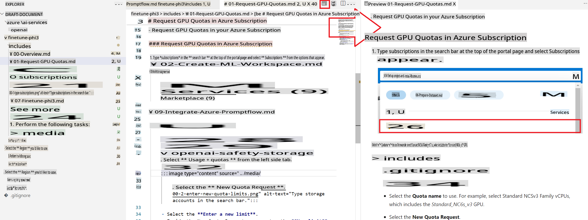
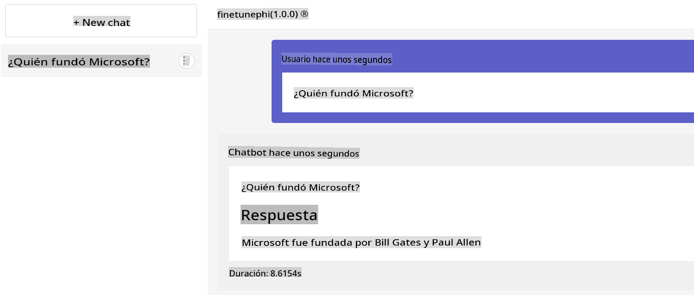

# VS Code Documentation Writing Tips

### Working with Preview

1. Click the newspaper icon shown below to display the markdown window on the left and the markdown preview on the right as you work.

    

### Using Automatic Numbering

> [!TIP]
> In markdown, even if you keep using `1.`, it will automatically number the list for you. This feature is handy when you need to change the order of steps in a tutorial without manually updating the numbers.
>

#### Example of Using Automatic Numbering

1. Type *azure machine learning* in the **search bar** at the top of the portal page and select **Azure Machine Learning** from the options that appear.

    

1. Select **+ Create** from the navigation menu.

1. Select **New workspace** from the navigation menu.

#### Without Using Automatic Numbering

1. Type *azure machine learning* in the **search bar** at the top of the portal page and select **Azure Machine Learning** from the options that appear.

    

2. Select **+ Create** from the navigation menu.

3. Select **New workspace** from the navigation menu.

### Indentation (Images, Code)

> [!TIP]
> When adding images or code that explain items like `1.` or `-`, indent the images or code by 4 spaces under the corresponding item.
>

#### Example of Proper Indentation

1. This section explains a chat example.

    

1. Next, ~

#### Without Proper Indentation

1. This section explains a chat example.

1. Next, ~

> [!NOTE]
> If images are not indented correctly, the automatic numbering feature won't work. Incorrect indentation can also reduce the readability of your document.

### When to Use `1.` Numbering and When to Use `-`

> [!TIP]
> If there are multiple tasks within a single image, use `1. 사진설명` and indent with `-`.
>

#### Example of Proper Use

1. Perform the following tasks:

    - Select your Azure **Subscription**.
    - Select the **Resource group** to use (create a new one if needed).
    - Enter **Workspace Name**. It must be a unique value.
    - Select the **Region** you'd like to use.
    - Select the **Storage account** to use (create a new one if needed).
    - Select the **Key vault** to use (create a new one if needed).
    - Select the **Application insights** to use (create a new one if needed).
    - Select the **Container registry** to **None**.

    

1. Select **Review + Create**.

1. Select **Create**.

#### Without Proper Use

1. Select your Azure **Subscription**.
1. Select the **Resource group** to use (create a new one if needed).
1. Enter **Workspace Name**. It must be a unique value.
1. Select the **Region** you'd like to use.
1. Select the **Storage account** to use (create a new one if needed).
1. Select the **Key vault** to use (create a new one if needed).
1. Select the **Application insights** to use (create a new one if needed).
1. Select the **Container registry** to **None**.

> [!NOTE]
> This way, it becomes difficult to properly indent the image.

1. Select **Review + Create**.

1. Select **Create**.

**Disclaimer**: 
This document has been translated using machine-based AI translation services. While we strive for accuracy, please be aware that automated translations may contain errors or inaccuracies. The original document in its native language should be considered the authoritative source. For critical information, professional human translation is recommended. We are not liable for any misunderstandings or misinterpretations arising from the use of this translation.