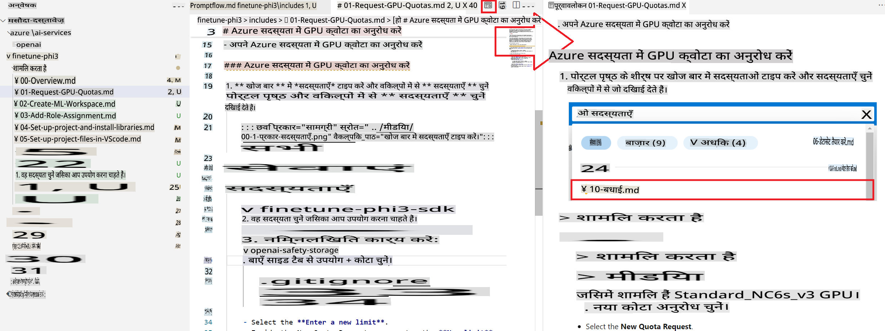
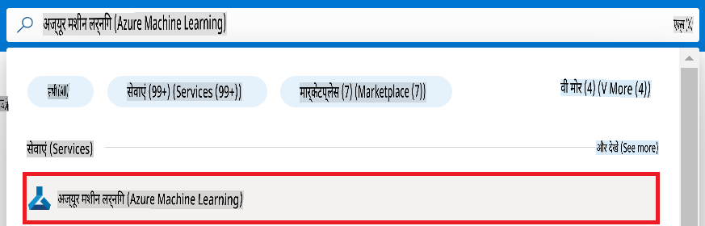
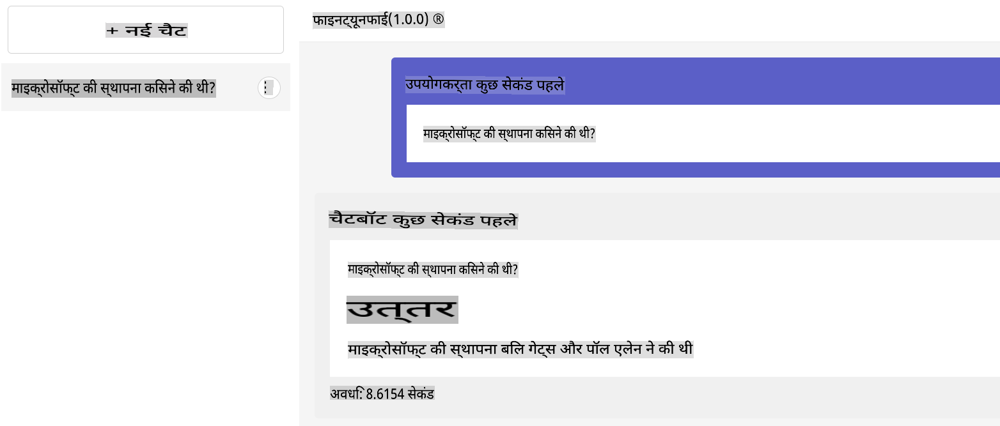
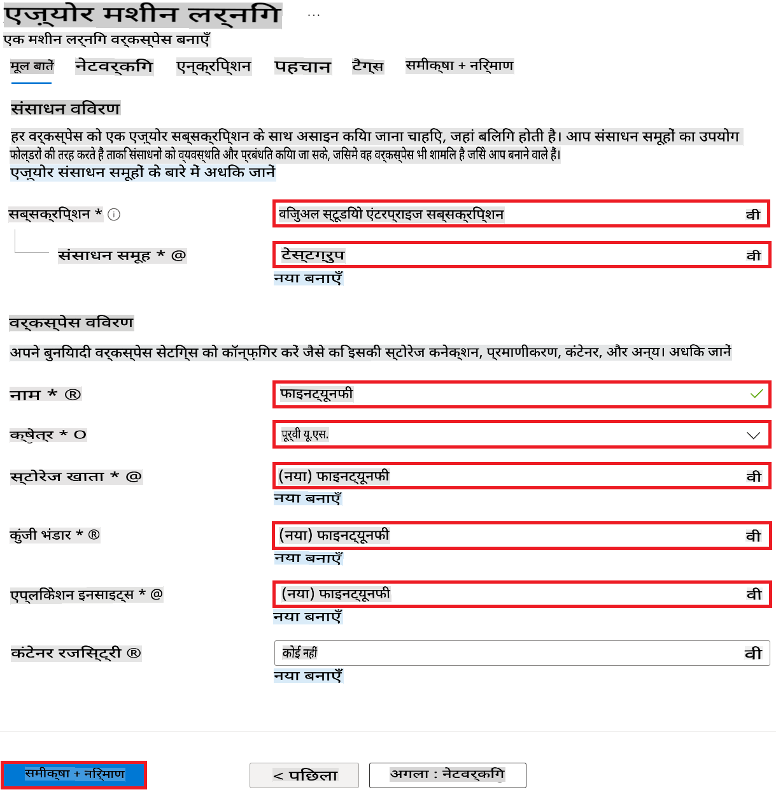

# VS Code दस्तावेज़ लेखन टिप्स

### पूर्वावलोकन का उपयोग करके काम करना

1. नीचे दिए गए चित्र में दिखाए गए समाचार पत्र आइकन को चुनें, जिससे बाईं ओर मार्कडाउन विंडो और दाईं ओर मार्कडाउन पूर्वावलोकन विंडो खुल जाएगी।

    

### स्वचालित नंबरिंग का उपयोग

> [!TIP]
> मार्कडाउन में, `1.` का उपयोग बार-बार करने पर भी यह स्वचालित रूप से क्रम तय कर देता है। स्वचालित नंबरिंग का उपयोग करने से ट्यूटोरियल में क्रम बदलने की स्थिति में आपको पुराने नंबर बदलने की आवश्यकता नहीं होती है, जिससे काम आसान हो जाता है।
>

#### स्वचालित नंबरिंग का उदाहरण

1. पोर्टल पेज के शीर्ष पर **खोज बार** में *azure machine learning* टाइप करें और जो विकल्प दिखाई दें उनमें से **Azure Machine Learning** चुनें।

    

1. नेविगेशन मेनू से **+ Create** चुनें।

1. नेविगेशन मेनू से **New workspace** चुनें।

#### स्वचालित नंबरिंग का उपयोग नहीं

1. पोर्टल पेज के शीर्ष पर **खोज बार** में *azure machine learning* टाइप करें और जो विकल्प दिखाई दें उनमें से **Azure Machine Learning** चुनें।

    

2. नेविगेशन मेनू से **+ Create** चुनें।

3. नेविगेशन मेनू से **New workspace** चुनें।

### इंडेंटेशन (चित्र, कोड)

> [!TIP]
> जब आप `1.` या `-` जैसी सूची का वर्णन करने के लिए चित्र या कोड संलग्न करते हैं, तो `1.` या `-` के नीचे 4 स्थानों का इंडेंटेशन लागू करके चित्र संलग्न करें।
>

#### इंडेंटेशन का उदाहरण

1. चैट उदाहरण का वर्णन करने वाली सामग्री।

    

1. अगली सामग्री ~

#### इंडेंटेशन नहीं

1. चैट उदाहरण का वर्णन करने वाली सामग्री।

1. अगली सामग्री~

> [!NOTE]
> यदि चित्र का इंडेंटेशन सही से नहीं किया गया है, तो स्वचालित नंबरिंग काम नहीं करेगी। इंडेंटेशन सही से न करने पर लेख की पठनीयता भी कम हो सकती है।

### कब `1.` नंबरिंग का उपयोग करें और कब `-` का

> [!TIP]
> यदि एक चित्र में कई काम करने हैं, तो `1. 사진설명` के अंदर इंडेंटेशन के साथ `-` का उपयोग करें।
>

#### लागू उदाहरण

1. निम्नलिखित कार्य करें:

    - अपने Azure **Subscription** का चयन करें।
    - उपयोग करने के लिए **Resource group** चुनें (यदि आवश्यक हो तो नया बनाएं)।
    - **Workspace Name** दर्ज करें। यह एक अद्वितीय मान होना चाहिए।
    - उपयोग करने के लिए **Region** चुनें।
    - उपयोग करने के लिए **Storage account** चुनें (यदि आवश्यक हो तो नया बनाएं)।
    - उपयोग करने के लिए **Key vault** चुनें (यदि आवश्यक हो तो नया बनाएं)।
    - उपयोग करने के लिए **Application insights** चुनें (यदि आवश्यक हो तो नया बनाएं)।
    - **Container registry** को **None** पर सेट करें।

    

1. **Review + Create** चुनें।

1. **Create** चुनें।

#### लागू नहीं

1. अपने Azure **Subscription** का चयन करें।
1. उपयोग करने के लिए **Resource group** चुनें (यदि आवश्यक हो तो नया बनाएं)।
1. **Workspace Name** दर्ज करें। यह एक अद्वितीय मान होना चाहिए।
1. उपयोग करने के लिए **Region** चुनें।
1. उपयोग करने के लिए **Storage account** चुनें (यदि आवश्यक हो तो नया बनाएं)।
1. उपयोग करने के लिए **Key vault** चुनें (यदि आवश्यक हो तो नया बनाएं)।
1. उपयोग करने के लिए **Application insights** चुनें (यदि आवश्यक हो तो नया बनाएं)।
1. **Container registry** को **None** पर सेट करें।

> [!NOTE]
> इस तरह करने पर इस चित्र का सही से इंडेंटेशन करना मुश्किल हो सकता है।

1. **Review + Create** चुनें।

1. **Create** चुनें।

**अस्वीकरण**:
यह दस्तावेज़ मशीन-आधारित एआई अनुवाद सेवाओं का उपयोग करके अनुवादित किया गया है। जबकि हम सटीकता के लिए प्रयास करते हैं, कृपया ध्यान दें कि स्वचालित अनुवादों में त्रुटियां या अशुद्धियां हो सकती हैं। मूल दस्तावेज़ को उसकी मूल भाषा में आधिकारिक स्रोत माना जाना चाहिए। महत्वपूर्ण जानकारी के लिए, पेशेवर मानव अनुवाद की सिफारिश की जाती है। इस अनुवाद के उपयोग से उत्पन्न किसी भी गलतफहमी या गलत व्याख्या के लिए हम उत्तरदायी नहीं हैं।