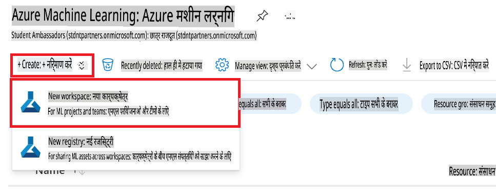

# VS Code ट्यूटोरियल लिखने के उदाहरण संग्रह

## ट्यूटोरियल लिखने का उदाहरण1

> [!TIP]
> **उदाहरण देखते समय ध्यान देने योग्य बातें**
>
> 1. फोटो के लिए 4 स्थान की इंडेंटेशन
> 1. कब `1.2.3.4.5` नंबरिंग करना है और कब `-` का उपयोग करना है
> 1. ऑटो नंबरिंग का उपयोग

### Azure Machine Learning Workspace बनाएं

1. पोर्टल पेज के टॉप पर **सर्च बार** में *azure machine learning* टाइप करें और दिखने वाले विकल्पों में से **Azure Machine Learning** को चुनें।

    

1. नेविगेशन मेनू से **+ Create** चुनें।

1. नेविगेशन मेनू से **New workspace** चुनें।

    

> [!TIP]
> यदि एक फोटो में कई चीजें क्लिक करनी हों तो `Perform the following tasks:` के बाद `-` के साथ इसे समूहित करें।
>

1. निम्नलिखित कार्य करें:

    - अपनी Azure **Subscription** चुनें।
    - उपयोग करने के लिए **Resource group** चुनें (यदि आवश्यक हो तो नया बनाएं)।
    - **Workspace Name** दर्ज करें। यह एक अद्वितीय मान होना चाहिए।
    - उपयोग करने के लिए **Region** चुनें।
    - उपयोग करने के लिए **Storage account** चुनें (यदि आवश्यक हो तो नया बनाएं)।
    - उपयोग करने के लिए **Key vault** चुनें (यदि आवश्यक हो तो नया बनाएं)।
    - उपयोग करने के लिए **Application insights** चुनें (यदि आवश्यक हो तो नया बनाएं)।
    - **Container registry** को **None** पर सेट करें।

    

1. **Review + Create** चुनें।

1. **Create** चुनें।

## ट्यूटोरियल लिखने का उदाहरण2

> [!TIP]
> **उदाहरण देखते समय ध्यान देने योग्य बातें**
>
> 1. कोड भाग के लिए 4 स्थान की इंडेंटेशन (ड्रैग करके समूहित करें और Tab दबाएं)
> 1. `!TIP, !NOTE` का उपयोग
>

### फाइन-ट्यूनिंग के लिए डेटासेट तैयार करें

इस अभ्यास में, आप *download_data.py* फ़ाइल चलाकर *wikitext* डेटासेट को अपने लोकल वातावरण में डाउनलोड करेंगे। फिर आप इस डेटासेट का उपयोग Azure Machine Learning में Phi-3 मॉडल को फाइन-ट्यून करने के लिए करेंगे।

#### *download_dataset.py* का उपयोग करके अपना डेटासेट डाउनलोड करें

1. Visual Studio Code में *download_data.py* फ़ाइल खोलें।

1. निम्नलिखित कोड *download_data.py* में जोड़ें।

    ```python
    import json
    import os
    from datasets import load_dataset
    from config import (
        TRAIN_DATA_PATH,
        TEST_DATA_PATH)

    def load_and_split_dataset(dataset_name, config_name, split_ratio):
        """
        Load and split a dataset.
        """
        # Load the dataset with the specified name and configuration
        dataset = load_dataset(dataset_name, config_name, split=split_ratio)
        print(f"Original dataset size: {len(dataset)}")
        
        # Split the dataset into train and test sets (80% train, 20% test)
        split_dataset = dataset.train_test_split(test_size=0.2)
        print(f"Train dataset size: {len(split_dataset['train'])}")
        print(f"Test dataset size: {len(split_dataset['test'])}")
        
        return split_dataset

    def save_dataset_to_jsonl(dataset, filepath):
        """
        Save a dataset to a JSONL file.
        """
        # Create the directory if it does not exist
        os.makedirs(os.path.dirname(filepath), exist_ok=True)
        
        # Open the file in write mode
        with open(filepath, 'w', encoding='utf-8') as f:
            # Iterate over each record in the dataset
            for record in dataset:
                # Dump the record as a JSON object and write it to the file
                json.dump(record, f)
                # Write a newline character to separate records
                f.write('\n')
        
        print(f"Dataset saved to {filepath}")

    def main():
        """
        Main function to load, split, and save the dataset.
        """
        # Load and split the dataset with a specific configuration and split ratio
        dataset = load_and_split_dataset("wikitext", 'wikitext-2-v1', 'train[:3%]')
        
        # Extract the train and test datasets from the split
        train_dataset = dataset['train']
        test_dataset = dataset['test']

        # Save the train dataset to a JSONL file
        save_dataset_to_jsonl(train_dataset, TRAIN_DATA_PATH)
        
        # Save the test dataset to a separate JSONL file
        save_dataset_to_jsonl(test_dataset, TEST_DATA_PATH)

    if __name__ == "__main__":
        main()

    ```

> [!TIP]
>
> **सीपीयू का उपयोग करके न्यूनतम डेटासेट के साथ फाइन-ट्यूनिंग के लिए मार्गदर्शन**
>
> यदि आप फाइन-ट्यूनिंग के लिए सीपीयू का उपयोग करना चाहते हैं, तो यह दृष्टिकोण उन लोगों के लिए आदर्श है जिनके पास लाभ सदस्यताएं (जैसे Visual Studio Enterprise Subscription) हैं या फाइन-ट्यूनिंग और डिप्लॉयमेंट प्रक्रिया को जल्दी से परखना चाहते हैं।
>
> `dataset = load_and_split_dataset("wikitext", 'wikitext-2-v1', 'train[:3%]')` with `dataset = load_and_split_dataset("wikitext", 'wikitext-2-v1', 'train[:10]')` को बदलें
>

1. निम्नलिखित कमांड को अपने टर्मिनल में टाइप करें ताकि स्क्रिप्ट चल सके और डेटासेट को आपके लोकल वातावरण में डाउनलोड कर सके।

    ```console
    python download_data.py
    ```

1. सत्यापित करें कि डेटासेट सफलतापूर्वक आपके लोकल *finetune-phi/data* डायरेक्टरी में सहेजे गए थे।

> [!NOTE]
>
> **डेटासेट का आकार और फाइन-ट्यूनिंग का समय**
>
> इस E2E सैंपल में, आप केवल 1% डेटासेट (`split='train[:3%]'`) का उपयोग करते हैं। यह डेटा की मात्रा को काफी कम कर देता है, जिससे अपलोड और फाइन-ट्यूनिंग दोनों प्रक्रियाएं तेज हो जाती हैं। आप प्रशिक्षण समय और मॉडल प्रदर्शन के बीच सही संतुलन खोजने के लिए प्रतिशत को समायोजित कर सकते हैं। डेटासेट का छोटा हिस्सा उपयोग करने से फाइन-ट्यूनिंग के लिए आवश्यक समय कम हो जाता है, जिससे E2E सैंपल के लिए प्रक्रिया अधिक प्रबंधनीय हो जाती है।

**अस्वीकरण**:
इस दस्तावेज़ का अनुवाद मशीन-आधारित एआई अनुवाद सेवाओं का उपयोग करके किया गया है। हम सटीकता के लिए प्रयास करते हैं, कृपया ध्यान दें कि स्वचालित अनुवाद में त्रुटियाँ या अशुद्धियाँ हो सकती हैं। मूल दस्तावेज़ को उसकी मूल भाषा में आधिकारिक स्रोत माना जाना चाहिए। महत्वपूर्ण जानकारी के लिए, पेशेवर मानव अनुवाद की सिफारिश की जाती है। इस अनुवाद के उपयोग से उत्पन्न किसी भी गलतफहमी या गलत व्याख्या के लिए हम जिम्मेदार नहीं हैं।