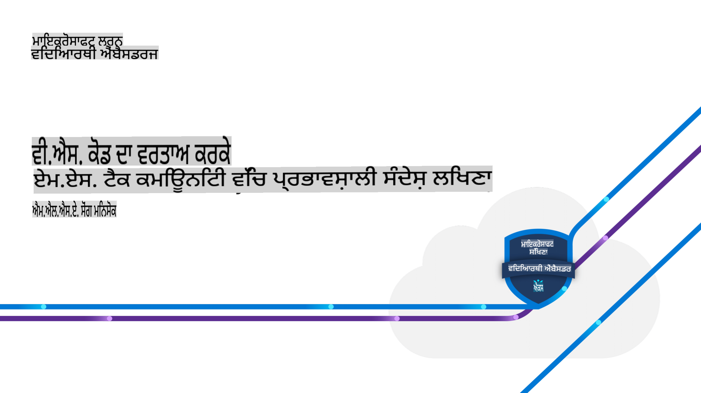

# VS Code ਨੂੰ ਵਰਤ ਕੇ MS Tech Community 'ਚ ਪ੍ਰਭਾਵਸ਼ਾਲੀ ਲਿਖਣ ਦੇ ਤਰੀਕੇ

## 🌐 ਬਹੁ-ਭਾਸ਼ਾਈ ਅਨੁਵਾਦ ਸਹਾਇਕ

> **ਨੋਟ:**
> ਇਹ ਅਨੁਵਾਦ ਖੁੱਲ੍ਹੇ ਸਰੋਤ [co-op-translator](https://github.com/Azure/co-op-translator) ਦੀ ਵਰਤੋਂ ਕਰਕੇ ਆਟੋਮੈਟਿਕ ਤੌਰ 'ਤੇ ਬਣਾਇਆ ਗਿਆ ਹੈ ਅਤੇ ਇਸ ਵਿੱਚ ਗਲਤੀਆਂ ਜਾਂ ਅਸਪਸ਼ਟ ਜਾਣਕਾਰੀ ਹੋ ਸਕਦੀ ਹੈ। ਮਹੱਤਵਪੂਰਨ ਜਾਣਕਾਰੀ ਲਈ ਅਸਲ ਸੰਦ ਨੂੰ ਦੇਖੋ ਜਾਂ ਪੇਸ਼ੇਵਰ ਅਨੁਵਾਦਕ ਨਾਲ ਸਲਾਹ ਕਰੋ। ਅਨੁਵਾਦ ਨੂੰ ਸ਼ਾਮਲ ਕਰਨ ਜਾਂ ਅਪਡੇਟ ਕਰਨ ਲਈ, ਸਧਾਰਨ ਹੁਕਮਾਂ ਦੀ ਵਰਤੋਂ ਕਰਕੇ ਆਸਾਨੀ ਨਾਲ ਯੋਗਦਾਨ ਪਾਉਣ ਲਈ [co-op-translator](https://github.com/Azure/co-op-translator) ਰਿਪੋਜ਼ਟਰੀ ਨੂੰ ਵੇਖੋ।

| Language             | Code | Link to Translated README                               | Last Updated |
|----------------------|------|---------------------------------------------------------|--------------|
| English | en   | [English Translation](../en/README.md)      | 2024-10-24   |
| Punjabi (Gurmukhi)| pa   | [Punjabi Translation](./README.md)      | 2024-10-24   |
| Hindi               | hi   | [Hindi  Translation](../hi/README.md)       | 2024-10-24   |

> [!NOTE]
> 2024년 7월 22일 월요일 오후 2시 20분부터 6시까지, 양천구 평생학습관 스마트창의인재센터 4층에서 한국 MLSA(Microsoft Learn Student Ambassadors)가 주최하는 "알쓸신기 - 알아두면 쓸모 있는 최신 기술들" 세미나에서 "VS Code를 활용해 MS Tech Community에 효과적으로 글쓰는 방법" 발표에서 제공되는 참고 및 실습자료 입니다.
>

## ਸਮੱਗਰੀ ਦੀ ਸੂਚੀ

1. [VS Code ਵਿੱਚ ਤਕਨੀਕੀ ਦਸਤਾਵੇਜ਼ ਲਿਖਣ ਦੇ ਕੁਝ ਟਿਪਸ](./ms-community-writer/includes/01-tips-for-vscode.md)(✅)
1. [VS Code ਵਿੱਚ ਤਕਨੀਕੀ ਦਸਤਾਵੇਜ਼ ਦਾ ਉਦਾਹਰਣ](./ms-community-writer/includes/02-example-for-vscode.md)(✅)

## ਪ੍ਰਜ਼ੇਂਟੇਸ਼ਨ ਸਾਂਝਾ ਕਰਨਾ

1. [ਪ੍ਰਜ਼ੇਂਟੇਸ਼ਨ: VS Code ਨੂੰ ਵਰਤ ਕੇ MS Tech Community 'ਚ ਪ੍ਰਭਾਵਸ਼ਾਲੀ ਲਿਖਣ ਦੇ ਤਰੀਕੇ -pdf](../../ms-community-writer/includes/presentation.pdf)(❌ PDF ਫਾਇਲ ਦਾ ਅਨੁਵਾਦ ਨਹੀਂ ਕੀਤਾ ਜਾ ਸਕਦਾ।)
1. [ਪ੍ਰਜ਼ੇਂਟੇਸ਼ਨ: VS Code ਨੂੰ ਵਰਤ ਕੇ MS Tech Community 'ਚ ਪ੍ਰਭਾਵਸ਼ਾਲੀ ਲਿਖਣ ਦੇ ਤਰੀਕੇ - ਮਾਰਕਡਾਊਨ](./ms-community-writer/includes/03-presentation.md)(✅ ਮਾਰਕਡਾਊਨ ਅਤੇ ਚਿੱਤਰਾਂ ਦਾ ਅਨੁਵਾਦ ਕੀਤਾ ਜਾ ਸਕਦਾ ਹੈ।)

**ਅਸਵੀਕਾਰਤਾ**:
ਇਹ ਦਸਤਾਵੇਜ਼ ਮਸ਼ੀਨ-ਅਧਾਰਿਤ ਏਆਈ ਅਨੁਵਾਦ ਸੇਵਾਵਾਂ ਦੀ ਵਰਤੋਂ ਕਰਕੇ ਅਨੁਵਾਦ ਕੀਤਾ ਗਿਆ ਹੈ। ਜਦੋਂ ਕਿ ਅਸੀਂ ਸਹੀ ਹੋਣ ਦਾ ਯਤਨ ਕਰਦੇ ਹਾਂ, ਕਿਰਪਾ ਕਰਕੇ ਧਿਆਨ ਦਿਓ ਕਿ ਸਵੈਚਾਲਿਤ ਅਨੁਵਾਦਾਂ ਵਿੱਚ ਗਲਤੀਆਂ ਜਾਂ ਅਸੁਚੀਤਤਾਵਾਂ ਹੋ ਸਕਦੀਆਂ ਹਨ। ਮੂਲ ਦਸਤਾਵੇਜ਼ ਨੂੰ ਇਸਦੀ ਮੂਲ ਭਾਸ਼ਾ ਵਿੱਚ ਅਧਿਕਾਰਕ ਸਰੋਤ ਮੰਨਿਆ ਜਾਣਾ ਚਾਹੀਦਾ ਹੈ। ਮਹੱਤਵਪੂਰਨ ਜਾਣਕਾਰੀ ਲਈ, ਪੇਸ਼ੇਵਰ ਮਨੁੱਖੀ ਅਨੁਵਾਦ ਦੀ ਸਿਫਾਰਸ਼ ਕੀਤੀ ਜਾਂਦੀ ਹੈ। ਅਸੀਂ ਇਸ ਅਨੁਵਾਦ ਦੀ ਵਰਤੋਂ ਤੋਂ ਪੈਦਾ ਹੋਣ ਵਾਲੀਆਂ ਕਿਸੇ ਵੀ ਗਲਤਫਹਮੀਆਂ ਜਾਂ ਗਲਤ ਵਿਵਹਾਰਾਂ ਲਈ ਜ਼ਿੰਮੇਵਾਰ ਨਹੀਂ ਹਾਂ।