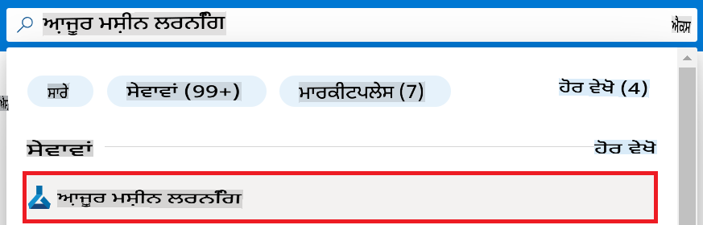
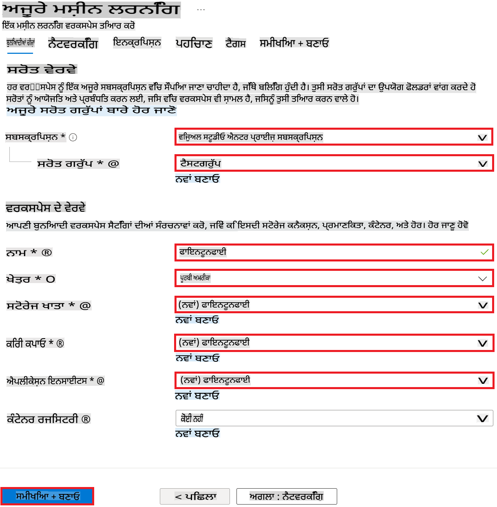

# VS Code ਦਸਤਾਵੇਜ਼ ਲਿਖਣ ਦੇ ਸੁਝਾਅ

### ਪੂਰਵਦਰਸ਼ਨ ਵਰਤ ਕੇ ਕੰਮ ਕਰਨਾ

1. ਹੇਠਾਂ ਦਿੱਤੇ ਚਿੱਤਰ ਵਿੱਚ ਦਿਖਾਈ ਗਈ ਅਖਬਾਰ ਦੇ ਆਕਾਰ ਵਾਲੀ ਬਟਨ ਨੂੰ ਚੁਣੋ ਅਤੇ ਖੱਬੇ ਪਾਸੇ ਮਾਰਕਡਾਊਨ ਖਿੜਕੀ ਅਤੇ ਸੱਜੇ ਪਾਸੇ ਮਾਰਕਡਾਊਨ ਉਦਾਹਰਣ ਖਿੜਕੀ ਨੂੰ ਖੋਲ੍ਹ ਕੇ ਕੰਮ ਕਰੋ।

    

### ਆਟੋਮੈਟਿਕ ਨੰਬਰਿੰਗ ਦੀ ਵਰਤੋਂ

> [!TIP]
> ਮਾਰਕਡਾਊਨ ਵਿੱਚ `1.` ਨੂੰ ਵਾਰ ਵਾਰ ਵਰਤਣ ਨਾਲ ਵੀ ਕ੍ਰਮ ਆਪੇ ਹੀ ਸੈੱਟ ਹੋ ਜਾਂਦਾ ਹੈ। ਆਟੋਮੈਟਿਕ ਨੰਬਰਿੰਗ ਫੀਚਰ ਦੀ ਵਰਤੋਂ ਕਰਨ ਨਾਲ ਟਿਊਟੋਰੀਅਲ ਵਿੱਚ ਵਿਆਖਿਆ ਕ੍ਰਮ ਨੂੰ ਬਦਲਣਾ ਸੌਖਾ ਹੁੰਦਾ ਹੈ ਬਿਨਾ ਪੁਰਾਣੇ ਨੰਬਰ ਬਦਲੇ।
>

#### ਆਟੋਮੈਟਿਕ ਨੰਬਰਿੰਗ ਦੀ ਵਰਤੋਂ ਦਾ ਉਦਾਹਰਣ

1. ਪੋਰਟਲ ਪੇਜ ਦੇ ਉੱਪਰਲੇ **ਖੋਜ ਪੱਟੀ** ਵਿੱਚ *azure machine learning* ਟਾਈਪ ਕਰੋ ਅਤੇ ਜੋ ਵਿਕਲਪ ਆਉਂਦੇ ਹਨ, ਉਨ੍ਹਾਂ ਵਿੱਚੋਂ **Azure Machine Learning** ਚੁਣੋ।

    

1. ਨੈਵੀਗੇਸ਼ਨ ਮੀਨੂ ਵਿੱਚੋਂ **+ Create** ਚੁਣੋ।

1. ਨੈਵੀਗੇਸ਼ਨ ਮੀਨੂ ਵਿੱਚੋਂ **New workspace** ਚੁਣੋ।

#### ਆਟੋਮੈਟਿਕ ਨੰਬਰਿੰਗ ਦੀ ਵਰਤੋਂ ਨਾ ਕਰਨ ਦਾ ਉਦਾਹਰਣ

1. ਪੋਰਟਲ ਪੇਜ ਦੇ ਉੱਪਰਲੇ **ਖੋਜ ਪੱਟੀ** ਵਿੱਚ *azure machine learning* ਟਾਈਪ ਕਰੋ ਅਤੇ ਜੋ ਵਿਕਲਪ ਆਉਂਦੇ ਹਨ, ਉਨ੍ਹਾਂ ਵਿੱਚੋਂ **Azure Machine Learning** ਚੁਣੋ।

    

2. ਨੈਵੀਗੇਸ਼ਨ ਮੀਨੂ ਵਿੱਚੋਂ **+ Create** ਚੁਣੋ।

3. ਨੈਵੀਗੇਸ਼ਨ ਮੀਨੂ ਵਿੱਚੋਂ **New workspace** ਚੁਣੋ।

### ਇੰਡੈਂਟੇਸ਼ਨ (ਚਿੱਤਰ, ਕੋਡ)

> [!TIP]
> `1.` ਜਾਂ `-` ਵਰਗੀਆਂ ਸੂਚੀਆਂ ਦੀ ਵਿਆਖਿਆ ਕਰਨ ਵਾਲੇ ਚਿੱਤਰ ਜਾਂ ਕੋਡ ਨੂੰ ਸ਼ਾਮਲ ਕਰਦੇ ਸਮੇਂ, `1.` ਜਾਂ `-` ਹੇਠਾਂ 4 ਸਪੇਸ ਦੇ ਇੰਡੈਂਟੇਸ਼ਨ ਨਾਲ ਚਿੱਤਰ ਸ਼ਾਮਲ ਕਰੋ।
>

#### ਇੰਡੈਂਟੇਸ਼ਨ ਦੀ ਵਰਤੋਂ ਦਾ ਉਦਾਹਰਣ

1. ਗੱਲਬਾਤ ਦੇ ਉਦਾਹਰਣ ਦੀ ਵਿਆਖਿਆ ਕਰਨ ਵਾਲਾ ਸਮੱਗਰੀ।

    

1. ਅਗਲਾ ਸਮੱਗਰੀ ~

#### ਇੰਡੈਂਟੇਸ਼ਨ ਨਾ ਕਰਨ ਦਾ ਉਦਾਹਰਣ

1. ਗੱਲਬਾਤ ਦੇ ਉਦਾਹਰਣ ਦੀ ਵਿਆਖਿਆ ਕਰਨ ਵਾਲਾ ਸਮੱਗਰੀ।

1. ਅਗਲਾ ਸਮੱਗਰੀ~

> [!NOTE]
> ਜੇਕਰ ਚਿੱਤਰ ਦਾ ਇੰਡੈਂਟੇਸ਼ਨ ਠੀਕ ਨਹੀਂ ਕੀਤਾ ਗਿਆ, ਤਾਂ ਆਟੋਮੈਟਿਕ ਨੰਬਰਿੰਗ ਫੀਚਰ ਕੰਮ ਨਹੀਂ ਕਰੇਗਾ। ਇੰਡੈਂਟੇਸ਼ਨ ਠੀਕ ਨਾ ਕਰਨ ਨਾਲ ਲਿਖਤ ਦੀ ਪੜਨਯੋਗਤਾ ਘਟ ਸਕਦੀ ਹੈ।

### ਕਦੋਂ `1.` ਨੰਬਰਿੰਗ ਅਤੇ ਕਦੋਂ `-` ਦੀ ਵਰਤੋਂ ਕਰਨੀ ਹੈ

> [!TIP]
> ਜੇ ਇੱਕ ਚਿੱਤਰ ਵਿੱਚ ਬਹੁਤ ਸਾਰੇ ਕੰਮ ਕਰਨੇ ਹਨ, ਤਾਂ `1. 사진설명` ਵਿੱਚ ਇੰਡੈਂਟ ਕਰਕੇ `-` ਨੂੰ ਸ਼ਾਮਲ ਕਰੋ।
>

#### ਵਰਤੋਂ ਦਾ ਉਦਾਹਰਣ

1. ਹੇਠਾਂ ਦਿੱਤੇ ਕੰਮ ਕਰੋ:

    - ਆਪਣੀ Azure **Subscription** ਚੁਣੋ।
    - ਵਰਤਣ ਲਈ **Resource group** ਚੁਣੋ (ਲੋੜ ਪੈਣ 'ਤੇ ਨਵੀਂ ਬਣਾਓ)।
    - **Workspace Name** ਦਰਜ ਕਰੋ। ਇਹ ਇੱਕ ਵਿਲੱਖਣ ਮੁੱਲ ਹੋਣਾ ਚਾਹੀਦਾ ਹੈ।
    - ਵਰਤਣ ਲਈ **Region** ਚੁਣੋ।
    - ਵਰਤਣ ਲਈ **Storage account** ਚੁਣੋ (ਲੋੜ ਪੈਣ 'ਤੇ ਨਵੀਂ ਬਣਾਓ)।
    - ਵਰਤਣ ਲਈ **Key vault** ਚੁਣੋ (ਲੋੜ ਪੈਣ 'ਤੇ ਨਵੀਂ ਬਣਾਓ)।
    - ਵਰਤਣ ਲਈ **Application insights** ਚੁਣੋ (ਲੋੜ ਪੈਣ 'ਤੇ ਨਵੀਂ ਬਣਾਓ)।
    - **Container registry** ਨੂੰ **None** 'ਤੇ ਸੈੱਟ ਕਰੋ।

    

1. **Review + Create** ਚੁਣੋ।

1. **Create** ਚੁਣੋ।

#### ਵਰਤੋਂ ਨਾ ਕਰਨ ਦਾ ਉਦਾਹਰਣ

1. ਆਪਣੀ Azure **Subscription** ਚੁਣੋ।
1. ਵਰਤਣ ਲਈ **Resource group** ਚੁਣੋ (ਲੋੜ ਪੈਣ 'ਤੇ ਨਵੀਂ ਬਣਾਓ)।
1. **Workspace Name** ਦਰਜ ਕਰੋ। ਇਹ ਇੱਕ ਵਿਲੱਖਣ ਮੁੱਲ ਹੋਣਾ ਚਾਹੀਦਾ ਹੈ।
1. ਵਰਤਣ ਲਈ **Region** ਚੁਣੋ।
1. ਵਰਤਣ ਲਈ **Storage account** ਚੁਣੋ (ਲੋੜ ਪੈਣ 'ਤੇ ਨਵੀਂ ਬਣਾਓ)।
1. ਵਰਤਣ ਲਈ **Key vault** ਚੁਣੋ (ਲੋੜ ਪੈਣ 'ਤੇ ਨਵੀਂ ਬਣਾਓ)।
1. ਵਰਤਣ ਲਈ **Application insights** ਚੁਣੋ (ਲੋੜ ਪੈਣ 'ਤੇ ਨਵੀਂ ਬਣਾਓ)।
1. **Container registry** ਨੂੰ **None** 'ਤੇ ਸੈੱਟ ਕਰੋ।

> [!NOTE]
> ਇਸ ਤਰੀਕੇ ਨਾਲ ਇਸ ਚਿੱਤਰ ਨੂੰ ਠੀਕ ਤਰ੍ਹਾਂ ਇੰਡੈਂਟ ਕਰਨਾ ਮੁਸ਼ਕਲ ਹੋ ਸਕਦਾ ਹੈ।

1. **Review + Create** ਚੁਣੋ।

1. **Create** ਚੁਣੋ।

**ਅਸਵੀਕਾਰ:**
ਇਹ ਦਸਤਾਵੇਜ਼ ਮਸ਼ੀਨ ਅਧਾਰਿਤ AI ਅਨੁਵਾਦ ਸੇਵਾਵਾਂ ਦੀ ਵਰਤੋਂ ਕਰਕੇ ਅਨੁਵਾਦ ਕੀਤਾ ਗਿਆ ਹੈ। ਹਾਲਾਂਕਿ ਅਸੀਂ ਸਹੀ ਹੋਣ ਦੀ ਕੋਸ਼ਿਸ਼ ਕਰਦੇ ਹਾਂ, ਕਿਰਪਾ ਕਰਕੇ ਸੂਚਿਤ ਰਹੋ ਕਿ ਸਵੈਚਾਲਿਤ ਅਨੁਵਾਦਾਂ ਵਿੱਚ ਗਲਤੀਆਂ ਜਾਂ ਅਸਹੀਤਾਂ ਹੋ ਸਕਦੀਆਂ ਹਨ। ਮੂਲ ਦਸਤਾਵੇਜ਼ ਨੂੰ ਇਸਦੀ ਮੂਲ ਭਾਸ਼ਾ ਵਿੱਚ ਅਧਿਕਾਰਕ ਸਰੋਤ ਮੰਨਿਆ ਜਾਣਾ ਚਾਹੀਦਾ ਹੈ। ਮਹੱਤਵਪੂਰਨ ਜਾਣਕਾਰੀ ਲਈ, ਪੇਸ਼ੇਵਰ ਮਨੁੱਖੀ ਅਨੁਵਾਦ ਦੀ ਸਿਫਾਰਿਸ਼ ਕੀਤੀ ਜਾਂਦੀ ਹੈ। ਅਸੀਂ ਇਸ ਅਨੁਵਾਦ ਦੇ ਉਪਯੋਗ ਤੋਂ ਉਤਪੰਨ ਹੋਣ ਵਾਲੀਆਂ ਕਿਸੇ ਵੀ ਗਲਤਫਹਿਮੀਆਂ ਜਾਂ ਗਲਤ ਵਿਆਖਿਆਵਾਂ ਲਈ ਜ਼ਿੰਮੇਵਾਰ ਨਹੀਂ ਹਾਂ।