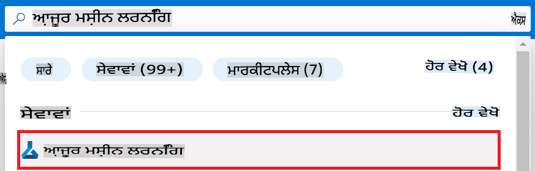
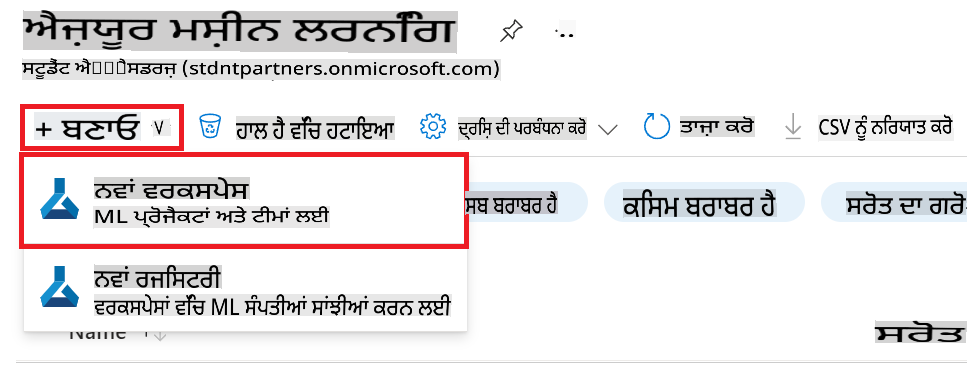
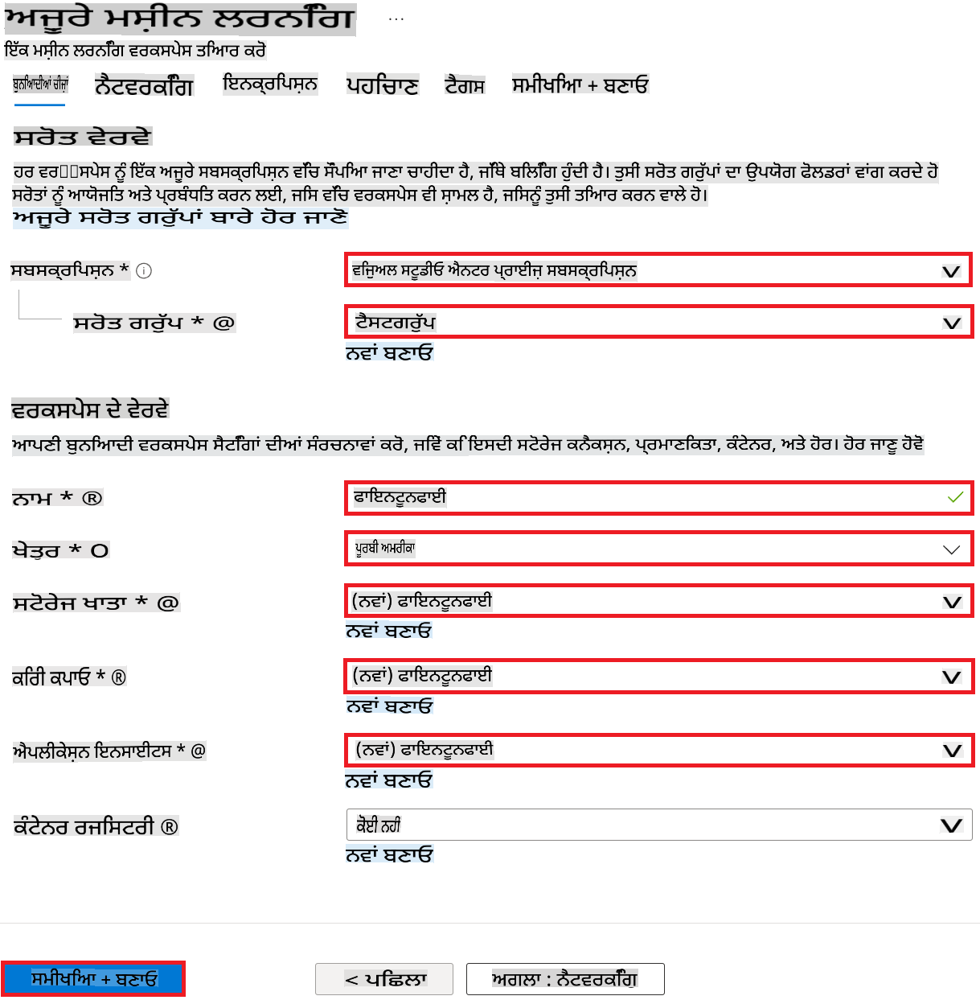

# VS Code ਟਿਊਟੋਰੀਅਲ ਲਿਖਣ ਦੇ ਉਦਾਹਰਨ

## ਟਿਊਟੋਰੀਅਲ ਲਿਖਣ ਦਾ ਉਦਾਹਰਨ1

> [!TIP]
> **ਉਦਾਹਰਨ ਵੇਖਦੇ ਹੋਏ ਇਹ ਗੱਲਾਂ ਧਿਆਨ ਵਿੱਚ ਰੱਖਣੀਆਂ ਹਨ**
>
> 1. ਫੋਟੋ 4 ਕਾਲਮ ਇੰਡੈਂਟਿੰਗ
> 1. ਕਦੋਂ `1.2.3.4.5` ਨੰਬਰਿੰਗ ਦੀ ਵਰਤੋਂ ਕਰਨੀ ਹੈ ਅਤੇ ਕਦੋਂ `-` ਦੀ ਵਰਤੋਂ ਕਰਨੀ ਹੈ
> 1. ਆਟੋਮੈਟਿਕ ਨੰਬਰਿੰਗ ਦੀ ਵਰਤੋਂ

### ਏਜ਼ਰ ਮਸ਼ੀਨ ਲਰਨਿੰਗ ਵਰਕਸਪੇਸ ਬਣਾਓ

1. ਪੋਰਟਲ ਪੇਜ਼ ਦੇ ਉੱਪਰਲੇ **ਸਰਚ ਬਾਰ** ਵਿੱਚ *azure machine learning* ਟਾਈਪ ਕਰੋ ਅਤੇ ਆਉਣ ਵਾਲੀਆਂ ਵਿਕਲਪਾਂ ਵਿੱਚੋਂ **Azure Machine Learning** ਚੁਣੋ।

    

1. ਨੈਵੀਗੇਸ਼ਨ ਮੇਨੂ ਵਿੱਚੋਂ **+ Create** ਚੁਣੋ।

1. ਨੈਵੀਗੇਸ਼ਨ ਮੇਨੂ ਵਿੱਚੋਂ **New workspace** ਚੁਣੋ।

    

> [!TIP]
> ਜੇਕਰ ਇੱਕ ਫੋਟੋ ਵਿੱਚ ਕਲਿਕ ਕਰਨ ਵਾਲੀਆਂ ਬਹੁਤ ਸਾਰੀਆਂ ਚੀਜ਼ਾਂ ਹਨ ਤਾਂ `Perform the following tasks:` ਦੇ ਬਾਅਦ `-` ਨਾਲ ਇਸਨੂੰ ਜੋੜ ਕੇ ਪ੍ਰਬੰਧਿਤ ਕਰੋ।
>

1. ਹੇਠਾਂ ਦਿੱਤੇ ਕੰਮ ਕਰੋ:

    - ਆਪਣੀ ਏਜ਼ਰ **Subscription** ਚੁਣੋ।
    - ਵਰਤਣ ਲਈ **Resource group** ਚੁਣੋ (ਲੋੜ ਪੈਣ 'ਤੇ ਨਵਾਂ ਬਣਾਓ)।
    - **Workspace Name** ਦਰਜ ਕਰੋ। ਇਹ ਇੱਕ ਵਿਲੱਖਣ ਮੁੱਲ ਹੋਣਾ ਚਾਹੀਦਾ ਹੈ।
    - ਵਰਤਣ ਲਈ **Region** ਚੁਣੋ।
    - ਵਰਤਣ ਲਈ **Storage account** ਚੁਣੋ (ਲੋੜ ਪੈਣ 'ਤੇ ਨਵਾਂ ਬਣਾਓ)।
    - ਵਰਤਣ ਲਈ **Key vault** ਚੁਣੋ (ਲੋੜ ਪੈਣ 'ਤੇ ਨਵਾਂ ਬਣਾਓ)।
    - ਵਰਤਣ ਲਈ **Application insights** ਚੁਣੋ (ਲੋੜ ਪੈਣ 'ਤੇ ਨਵਾਂ ਬਣਾਓ)।
    - **Container registry** ਨੂੰ **None** ਚੁਣੋ।

    

1. **Review + Create** ਚੁਣੋ।

1. **Create** ਚੁਣੋ।

## ਟਿਊਟੋਰੀਅਲ ਲਿਖਣ ਦਾ ਉਦਾਹਰਨ2

> [!TIP]
> **ਉਦਾਹਰਨ ਵੇਖਦੇ ਹੋਏ ਇਹ ਗੱਲਾਂ ਧਿਆਨ ਵਿੱਚ ਰੱਖਣੀਆਂ ਹਨ**
>
> 1. ਕੋਡ ਹਿੱਸੇ ਨੂੰ 4 ਕਾਲਮ ਇੰਡੈਂਟਿੰਗ (ਡ੍ਰੈਗ ਕਰਕੇ ਟੈਬ ਦਬਾਓ)
> 1. `!TIP, !NOTE` ਦੀ ਵਰਤੋਂ
>

### ਡਾਟਾਸੈੱਟ ਨੂੰ ਫਾਈਨ-ਟਿਊਨਿੰਗ ਲਈ ਤਿਆਰ ਕਰੋ

ਇਸ ਕਸਰਤ ਵਿੱਚ, ਤੁਸੀਂ *download_data.py* ਫਾਈਲ ਨੂੰ ਚਲਾਕੇ *wikitext* ਡਾਟਾਸੈੱਟ ਨੂੰ ਆਪਣੇ ਸਥਾਨਕ ਵਾਤਾਵਰਣ ਵਿੱਚ ਡਾਊਨਲੋਡ ਕਰੋਗੇ। ਫਿਰ ਤੁਸੀਂ ਇਸ ਡਾਟਾਸੈੱਟ ਨੂੰ ਏਜ਼ਰ ਮਸ਼ੀਨ ਲਰਨਿੰਗ ਵਿੱਚ Phi-3 ਮਾਡਲ ਨੂੰ ਫਾਈਨ-ਟਿਊਨ ਕਰਨ ਲਈ ਵਰਤੋਂਗੇ।

#### *download_dataset.py* ਦੀ ਵਰਤੋਂ ਕਰਕੇ ਆਪਣੇ ਡਾਟਾਸੈੱਟ ਨੂੰ ਡਾਊਨਲੋਡ ਕਰੋ

1. Visual Studio Code ਵਿੱਚ *download_data.py* ਫਾਈਲ ਖੋਲ੍ਹੋ।

1. ਹੇਠਾਂ ਦਿੱਤਾ ਕੋਡ *download_data.py* ਵਿੱਚ ਸ਼ਾਮਲ ਕਰੋ।

    ```python
    import json
    import os
    from datasets import load_dataset
    from config import (
        TRAIN_DATA_PATH,
        TEST_DATA_PATH)

    def load_and_split_dataset(dataset_name, config_name, split_ratio):
        """
        Load and split a dataset.
        """
        # Load the dataset with the specified name and configuration
        dataset = load_dataset(dataset_name, config_name, split=split_ratio)
        print(f"Original dataset size: {len(dataset)}")
        
        # Split the dataset into train and test sets (80% train, 20% test)
        split_dataset = dataset.train_test_split(test_size=0.2)
        print(f"Train dataset size: {len(split_dataset['train'])}")
        print(f"Test dataset size: {len(split_dataset['test'])}")
        
        return split_dataset

    def save_dataset_to_jsonl(dataset, filepath):
        """
        Save a dataset to a JSONL file.
        """
        # Create the directory if it does not exist
        os.makedirs(os.path.dirname(filepath), exist_ok=True)
        
        # Open the file in write mode
        with open(filepath, 'w', encoding='utf-8') as f:
            # Iterate over each record in the dataset
            for record in dataset:
                # Dump the record as a JSON object and write it to the file
                json.dump(record, f)
                # Write a newline character to separate records
                f.write('\n')
        
        print(f"Dataset saved to {filepath}")

    def main():
        """
        Main function to load, split, and save the dataset.
        """
        # Load and split the dataset with a specific configuration and split ratio
        dataset = load_and_split_dataset("wikitext", 'wikitext-2-v1', 'train[:3%]')
        
        # Extract the train and test datasets from the split
        train_dataset = dataset['train']
        test_dataset = dataset['test']

        # Save the train dataset to a JSONL file
        save_dataset_to_jsonl(train_dataset, TRAIN_DATA_PATH)
        
        # Save the test dataset to a separate JSONL file
        save_dataset_to_jsonl(test_dataset, TEST_DATA_PATH)

    if __name__ == "__main__":
        main()

    ```

> [!TIP]
>
> **ਸਿੱਖਣ ਲਈ ਘੱਟ ਡਾਟਾਸੈੱਟ ਦੇ ਨਾਲ ਫਾਈਨ-ਟਿਊਨਿੰਗ ਲਈ ਮਾਰਗਦਰਸ਼ਨ**
>
> ਜੇ ਤੁਸੀਂ ਸਿੱਖਣ ਲਈ CPU ਦੀ ਵਰਤੋਂ ਕਰਨਾ ਚਾਹੁੰਦੇ ਹੋ, ਤਾਂ ਇਹ ਪਹੁੰਚ ਉਹਨਾਂ ਲਈ ਵਧੀਆ ਹੈ ਜੋ ਲਾਭਦਾਇਕ ਸਬਸਕ੍ਰਿਪਸ਼ਨ (ਜਿਵੇਂ ਕਿ Visual Studio Enterprise Subscription) ਰੱਖਦੇ ਹਨ ਜਾਂ ਫਾਈਨ-ਟਿਊਨਿੰਗ ਅਤੇ ਡਿਪਲੌਇਮੈਂਟ ਪ੍ਰਕਿਰਿਆ ਨੂੰ ਜਲਦੀ ਅਜ਼ਮਾਉਣਾ ਚਾਹੁੰਦੇ ਹਨ।
>
> `dataset = load_and_split_dataset("wikitext", 'wikitext-2-v1', 'train[:3%]')` with `dataset = load_and_split_dataset("wikitext", 'wikitext-2-v1', 'train[:10]')` ਨਾਲ ਬਦਲੋ।
>

1. ਹੇਠਾਂ ਦਿੱਤਾ ਕਮਾਂਡ ਆਪਣੇ ਟਰਮੀਨਲ ਵਿੱਚ ਟਾਈਪ ਕਰੋ ਤਾਂ ਜੋ ਸਕ੍ਰਿਪਟ ਚੱਲ ਸਕੇ ਅਤੇ ਡਾਟਾਸੈੱਟ ਨੂੰ ਸਥਾਨਕ ਵਾਤਾਵਰਣ ਵਿੱਚ ਡਾਊਨਲੋਡ ਕੀਤਾ ਜਾ ਸਕੇ।

    ```console
    python download_data.py
    ```

1. ਇਹ ਯਕੀਨੀ ਬਣਾਓ ਕਿ ਡਾਟਾਸੈੱਟ ਨੂੰ ਸਫਲਤਾਪੂਰਵਕ ਸਥਾਨਕ *finetune-phi/data* ਡਾਇਰੈਕਟਰੀ ਵਿੱਚ ਸੇਵ ਕੀਤਾ ਗਿਆ ਹੈ।

> [!NOTE]
>
> **ਡਾਟਾਸੈੱਟ ਦਾ ਆਕਾਰ ਅਤੇ ਫਾਈਨ-ਟਿਊਨਿੰਗ ਸਮਾਂ**
>
> ਇਸ E2E ਨਮੂਨੇ ਵਿੱਚ, ਤੁਸੀਂ ਸਿਰਫ 1% ਡਾਟਾਸੈੱਟ (`split='train[:3%]'`) ਦੀ ਵਰਤੋਂ ਕਰਦੇ ਹੋ। ਇਹ ਡਾਟੇ ਦੀ ਮਾਤਰਾ ਨੂੰ ਕਾਫੀ ਘਟਾ ਦਿੰਦਾ ਹੈ, ਅੱਪਲੋਡ ਅਤੇ ਫਾਈਨ-ਟਿਊਨਿੰਗ ਪ੍ਰਕਿਰਿਆ ਦੋਵਾਂ ਨੂੰ ਤੇਜ਼ ਕਰਦਾ ਹੈ। ਤੁਸੀਂ ਟ੍ਰੇਨਿੰਗ ਸਮੇਂ ਅਤੇ ਮਾਡਲ ਦੇ ਪ੍ਰਦਰਸ਼ਨ ਦੇ ਵਿਚਕਾਰ ਸਹੀ ਸੰਤੁਲਨ ਲੱਭਣ ਲਈ ਪ੍ਰਤੀਸ਼ਤ ਨੂੰ ਸਮਾਂਜਸ ਕਰ ਸਕਦੇ ਹੋ। ਛੋਟੇ ਡਾਟਾਸੈੱਟ ਦੇ ਇੱਕ ਉਪਸੈੱਟ ਦੀ ਵਰਤੋਂ ਕਰਨ ਨਾਲ ਫਾਈਨ-ਟਿਊਨਿੰਗ ਲਈ ਲੱਗਣ ਵਾਲਾ ਸਮਾਂ ਘਟ ਜਾਂਦਾ ਹੈ, ਜਿਸ ਨਾਲ E2E ਨਮੂਨੇ ਲਈ ਪ੍ਰਕਿਰਿਆ ਹੋਰ ਸੰਜੋਗੀ ਬਣ ਜਾਂਦੀ ਹੈ।

**ਅਸਵੀਕਾਰਨਾ**:
ਇਹ ਦਸਤਾਵੇਜ਼ ਮਸ਼ੀਨ-ਅਧਾਰਿਤ AI ਅਨੁਵਾਦ ਸੇਵਾਵਾਂ ਦੀ ਵਰਤੋਂ ਕਰਕੇ ਅਨੁਵਾਦ ਕੀਤਾ ਗਿਆ ਹੈ। ਹਾਲਾਂਕਿ ਅਸੀਂ ਸਹੀ ਹੋਣ ਦੀ ਕੋਸ਼ਿਸ਼ ਕਰਦੇ ਹਾਂ, ਕਿਰਪਾ ਕਰਕੇ ਧਿਆਨ ਦਿਓ ਕਿ ਸਵੈਚਾਲਿਤ ਅਨੁਵਾਦਾਂ ਵਿੱਚ ਗਲਤੀਆਂ ਜਾਂ ਅਸੰਬੰਧਤ ਤੱਥ ਹੋ ਸਕਦੇ ਹਨ। ਇਸਦੀ ਮੂਲ ਭਾਸ਼ਾ ਵਿੱਚ ਮੂਲ ਦਸਤਾਵੇਜ਼ ਨੂੰ ਪ੍ਰਮਾਣਕ ਸਰੋਤ ਮੰਨਿਆ ਜਾਣਾ ਚਾਹੀਦਾ ਹੈ। ਮਹੱਤਵਪੂਰਨ ਜਾਣਕਾਰੀ ਲਈ, ਪੇਸ਼ੇਵਰ ਮਨੁੱਖੀ ਅਨੁਵਾਦ ਦੀ ਸਿਫਾਰਸ਼ ਕੀਤੀ ਜਾਂਦੀ ਹੈ। ਅਸੀਂ ਇਸ ਅਨੁਵਾਦ ਦੀ ਵਰਤੋਂ ਤੋਂ ਪੈਦਾ ਹੋਣ ਵਾਲੇ ਕਿਸੇ ਵੀ ਗਲਤ ਫਹਿਮੀ ਜਾਂ ਗਲਤ ਅਰਥ ਲਈ ਜ਼ਿੰਮੇਵਾਰ ਨਹੀਂ ਹਾਂ।